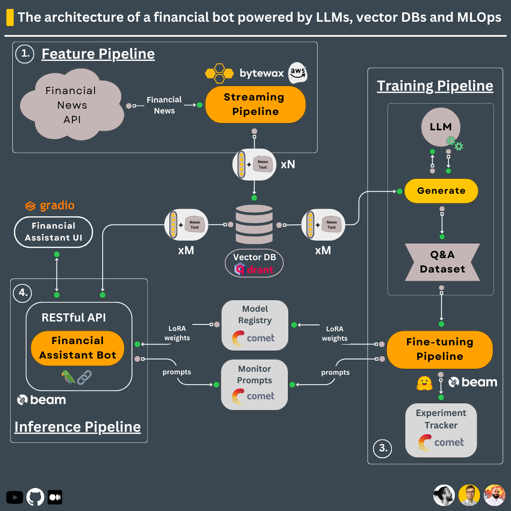
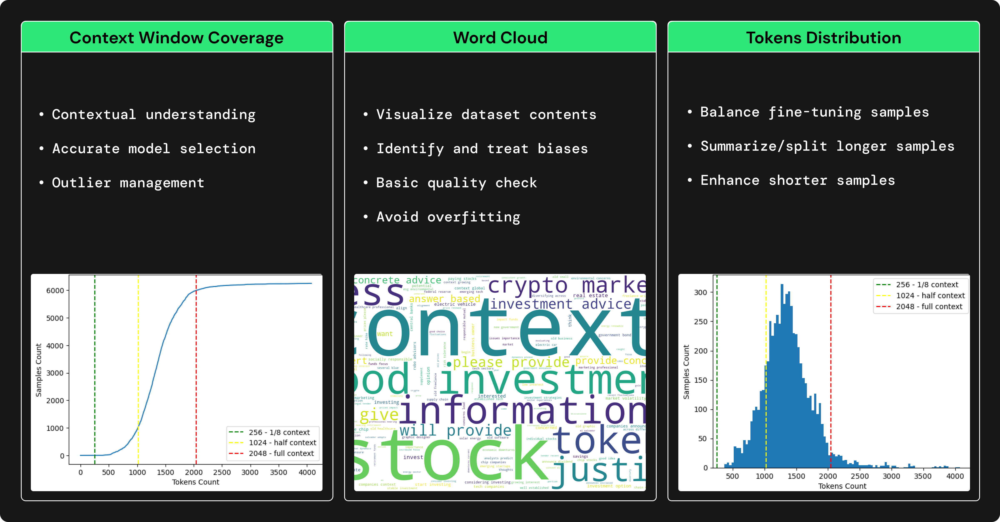

# Serverless LLM

Serverless LLM pipeline architecture (feature, training, and inference pipeline) based on [hands-on-llms](https://github.com/iusztinpaul/hands-on-llms) except there is no local run required for the training step as many users may not have a CUDA-enabled Nvidia GPU with enough memory to be able to train locally.

## 1. Serverless Architecture



## 2. Building Blocks

### 2.1. Training Pipeline

Training pipeline that:

1. Loads a proprietary Q&A dataset
2. Fine-tunes an open-source LLM using QLoRA
3. Logs the training experiments on [Comet ML's](https://www.comet.com?utm_source=thepauls&utm_medium=partner&utm_content=github) experiment tracker & the inference results on [Comet ML's](https://www.comet.com?utm_source=thepauls&utm_medium=partner&utm_content=github) LLMOps dashboard
4. Stores the best model on [Comet ML's](https://www.comet.com/site/products/llmops/?utm_source=thepauls&utm_medium=partner&utm_content=github) model registry

The **training pipeline** is **deployed** using [Beam](https://docs.beam.cloud/getting-started/quickstart?utm_source=thepauls&utm_medium=partner&utm_content=github) as a serverless GPU infrastructure.

-> Found under the `modules/training_pipeline` directory.

#### 💻 Minimum Hardware Requirements

Deploy the training pipeline to [Beam's](https://docs.beam.cloud/getting-started/quickstart?utm_source=thepauls&utm_medium=partner&utm_content=github) serverless infrastructure and train the LLM there.

### 2.2. Streaming Real-time Pipeline

Real-time feature pipeline that:

1. Ingests financial news from [Alpaca](https://alpaca.markets/docs/api-references/market-data-api/news-data/)
2. Cleans & transforms the news documents into embeddings in real-time using [Bytewax](https://github.com/bytewax/bytewax?utm_source=thepauls&utm_medium=partner&utm_content=github)
3. Stores the embeddings into the [Qdrant Vector DB](https://qdrant.tech/?utm_source=thepauls&utm_medium=partner&utm_content=github)

The **streaming pipeline** is **automatically deployed** on an AWS EC2 machine using a CI/CD pipeline built in GitHub actions.

-> Found under the `modules/streaming_pipeline` directory.

### 2.3. Inference Pipeline

Inference pipeline that uses [LangChain](https://github.com/langchain-ai/langchain) to create a chain that:

1. Downloads the fine-tuned model from [Comet's](https://www.comet.com?utm_source=thepauls&utm_medium=partner&utm_content=github) model registry
2. Takes user questions as input
3. Queries the [Qdrant Vector DB](https://qdrant.tech/?utm_source=thepauls&utm_medium=partner&utm_content=github) and enhances the prompt with related financial news
4. Calls the fine-tuned LLM for financial advice using the initial query, the context from the vector DB, and the chat history
5. Persists the chat history into memory
6. Logs the prompt & answer into [Comet ML's](https://www.comet.com/site/products/llmops/?utm_source=thepauls&utm_medium=partner&utm_content=github) LLMOps monitoring feature

The **inference pipeline** is **deployed** using [Beam](https://docs.beam.cloud/deployment/rest-api?utm_source=thepauls&utm_medium=partner&utm_content=github) as a serverless GPU infrastructure, as a RESTful API. Also, it is wrapped under a UI for demo purposes, implemented in [Gradio](https://www.gradio.app/).

-> Found under the `modules/financial_bot` directory.

#### 💻 Minimum Hardware Requirements

Deploy the inference pipeline to [Beam's](https://docs.beam.cloud/getting-started/quickstart?utm_source=thepauls&utm_medium=partner&utm_content=github) serverless infrastructure and call the LLM from there.

### 2.4. Financial Q&A Dataset

Leveraging `GPT3.5` to generate a financial Q&A dataset to fine-tune our open-source LLM to specialize in using financial terms and answering financial questions. Using a large LLM, such as `GPT3.5` to generate a dataset that trains a smaller LLM (e.g., Falcon 7B) is known as **fine-tuning with distillation**.

→ To understand how the financial Q&A dataset is generated, [check out this article](https://open.substack.com/pub/paulabartabajo/p/how-to-generate-financial-q-and-a?r=1ttoeh&utm_campaign=post&utm_medium=web) written by [Pau Labarta](https://github.com/Paulescu).

→ To see a complete analysis of the financial Q&A dataset, check out the [dataset_analysis](https://github.com/iusztinpaul/hands-on-llms/blob/main/dataset_analysis) subsection of the course written by [Alexandru Razvant](https://github.com/Joywalker).



## 3. Setup External Services

Before diving into the modules, you have to set up a couple of additional external tools for the course.

**NOTE:** You can set them up as you go for every module, as we will point you in every module what you need.

### 3.1. Alpaca

`financial news data source`

Follow this [document](https://alpaca.markets/docs/market-data/getting-started/) to show you how to create a FREE account and generate the API Keys you will need within this course.

**Note:** 1x Alpaca data connection is FREE.

### 3.2. Qdrant

`serverless vector DB`

Go to [Qdrant](https://qdrant.tech/?utm_source=thepauls&utm_medium=partner&utm_content=github) and create a FREE account.

After, follow [this document](https://qdrant.tech/documentation/cloud/authentication/?utm_source=thepauls&utm_medium=partner&utm_content=github) on how to generate the API Keys you will need within this course.

**Note:** We will use only Qdrant's freemium plan.

### 3.3. Comet ML

`serverless ML platform`

Go to [Comet ML](https://www.comet.com/signup?utm_source=thepauls&utm_medium=partner&utm_content=github) and create a FREE account.

After, [follow this guide](https://www.comet.com/docs/v2/guides/getting-started/quickstart/) to generate an API KEY and a new project, which you will need within the course.

**Note:** We will use only Comet ML's freemium plan.

### 3.4. Beam

`serverless GPU compute | training & inference pipelines`

Go to [Beam](https://www.beam.cloud?utm_source=thepauls&utm_medium=partner&utm_content=github) and create a FREE account.

After, you must follow their [installation guide](https://docs.beam.cloud/getting-started/installation?utm_source=thepauls&utm_medium=partner&utm_content=github) to install their CLI & configure it with your Beam credentials.

To read more about Beam, here is an [introduction guide](https://docs.beam.cloud/getting-started/introduction?utm_source=thepauls&utm_medium=partner&utm_content=github).

**Note:** You have ~10 free compute hours. Afterward, you pay only for what you use. If you have an Nvidia GPU >8 GB VRAM & don't want to deploy the training & inference pipelines, using Beam is optional.

#### Troubleshooting

When using Poetry, we had issues locating the Beam CLI inside a Poetry virtual environment. To fix this, after installing Beam, we create a symlink that points to Poetry's binaries, as follows:

```shell
 export COURSE_MODULE_PATH=<your-course-module-path> # e.g., modules/training_pipeline
 cd $COURSE_MODULE_PATH
 export POETRY_ENV_PATH=$(dirname $(dirname $(poetry run which python)))

 ln -s /usr/local/bin/beam ${POETRY_ENV_PATH}/bin/beam
```

### 3.5. AWS

`cloud compute | feature pipeline`

Go to [AWS](https://aws.amazon.com/console/), create an account, and generate a pair of credentials.

After, download and install their [AWS CLI v2.11.22](https://docs.aws.amazon.com/cli/latest/userguide/getting-started-install.html) and [configure it](https://docs.aws.amazon.com/cli/latest/userguide/cli-chap-configure.html) with your credentials.

**Note:** You will pay only for what you use. You will deploy only a `t2.small` EC2 VM, which is only `~$0.023` / hour. If you don't want to deploy the feature pipeline, using AWS is optional.

## 4. Install & Usage

Every module has its dependencies and scripts. In a production setup, every module would have its repository but for learning purposes everything is in one place:

Check out the README for every module individually to see how to install & use it:

1. [q_and_a_dataset_generator](/modules/q_and_a_dataset_generator/)
2. [training_pipeline](/modules/training_pipeline/)
3. [streaming_pipeline](/modules/streaming_pipeline/)
4. [inference_pipeline](/modules/financial_bot/)
